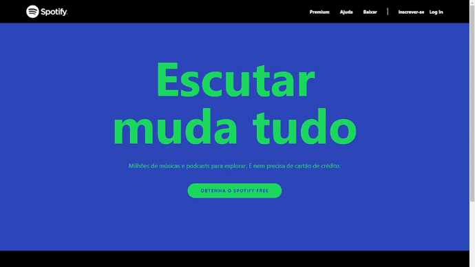

  

<h1 align="center">
 <a href="https://hailton-nascimento.github.io/SpotifyTailwind/" target="_blank" rel="noopener noreferrer">Demo</a>
</h1>

##  Spotify UI Clone Com TailwindCSS

Clone da pagina do Oficial do Spotify, utilizando o Framework Tailwind para praticar a utilização do mesmo no desenvovimento de Layout responsivo, já que é uma das premissas do Tailwindcss.

## 🚀 Tecnologias utilizadas:

Foram utilizadas as seguintes tecnologias:

<ul>
    <li>HTML</li>
    <li>Tailwind</li>
</ul>

### Contato

- Github - [Hailton Nascimento](https://github.com/Hailton-Nascimento)
- LinkedIn - [Hailton Nascimento](https://linkedin.com/in/hailton-nascimento)
